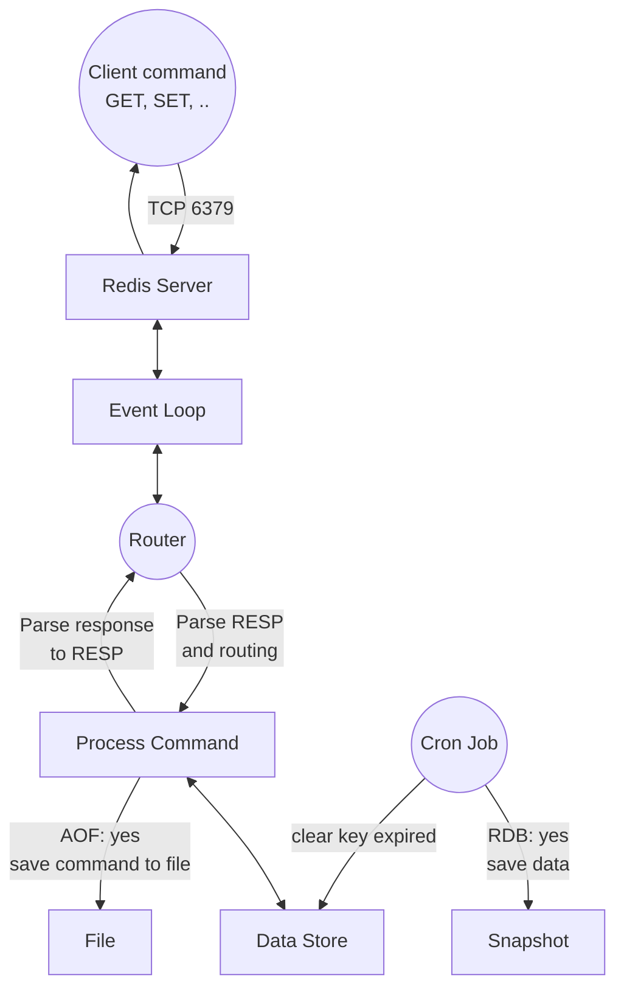
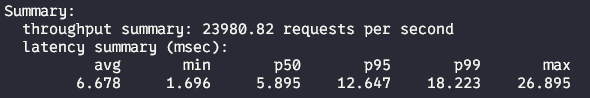
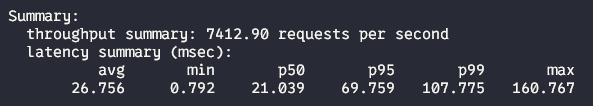
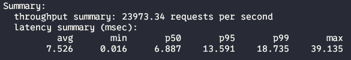
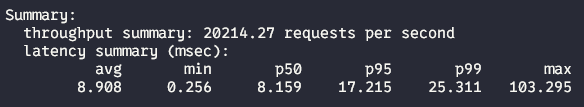

# redis-java


## Flow chart



## List feature

| Feature              | Supported |
|----------------------|-----------|
| Support TTL (expire) | ✅         |
| Save RDB or AOF      | ✅         |
| Pub/Sub              | ❌         |
| Multi/Transaction    | ❌         |
| Cluster/Replication  | ❌         |
| Redis Modules        | ❌         |

## Config

```yaml
#app.properties

# config save AOF
persistence.mode=AOF

  # config RDB
persistence.mode=RDB
rdb.snapshot.interval=30 # time between save (second)

  # clean key expire after time 
ttl.clean.interval=1000 # milisecond
```

## Testing

```shell
# connect to redis using redis cli
redis-cli -h 127.0.0.1 -p 6379

# set key x with value 100
set x 100

# set key y with value 100 and expiry 10 seconds 
set y 100 ex 10

# get value key x 
get x

# delete key x
del x
```

## Stress testing 

```shell
for i in {1..100}; do redis-cli -h <host> -p <port> set key$i "value$i"; done
```

## Benchmark 

```shell
redis-benchmark  -h <host> -p <port> -t set -n 100000 -c 200

redis-benchmark -h <host> -p <port> -a "<password>" -t set -n 100000 -c 200


redis-benchmark  -h <host> -p 6379 -t get -n 1000000 -c 200

redis-benchmark -h <host> -p <port> -a "<password>" -t get -n 1000000 -c 200
```

Redis-Java


---
Ten thousand keys

Redis


Redis Java


----
- One million keys

Redis 


Redis Java

---


## RESP3

| RESP3                   | Supported |
|-------------------------|-----------|
| Simple, Bulk, Verbatim  | ✅         |
| Integer, Double, BigInt | ✅         |
| Null, Boolean           | ✅         |
| Array, Map, Attributes  | ✅         |


## TODO

- Authentication
- Pub/Sub

